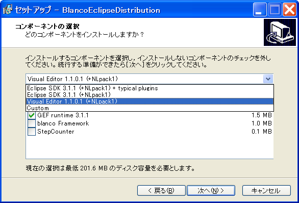

[top](https://igapyon.github.io/diary/) 
 / [index](https://igapyon.github.io/diary/2005/index.html) 
 / [prev](https://igapyon.github.io/diary/2005/ig051106.html) 
 / [next](https://igapyon.github.io/diary/2005/ig051112.html) 
 / [target](https://igapyon.github.io/diary/2005/ig051109.html) 
 / [source](https://github.com/igapyon/diary/blob/gh-pages/2005/ig051109.html.src.md) 

2005-11-09 diary: BlancoEclipseDistribution (Windows版) を構想中…
=====================================================================================================
 日記形式でつづる [いがぴょん](https://igapyon.github.io/diary/memo/memoigapyon.html)コラム ウェブページです。

[old-v2](ig051109-orig.html)

## BlancoEclipseDistribution (Windows版) を構想中…

blanco Frameworkとして Eclipseディストリビューションを構想中です。

## BlancoEclipseDistribution (Windows版) を構想中

[blanco](http://www.igapyon.jp/blanco/blanco.ja.html) Frameworkとして Eclipseディストリビューションの構想に着手しました。[BlancoEclipseDistribution](http://www.igapyon.jp/blanco/blancoeclipsedistribution.html)と命名しました。
(※まだ2005.11.09時点では blanco Frameworkのメンバによる承認は得られていません)

以前考えていた [EclipseInstaller](http://www.igapyon.jp/igapyon/diary/keyword/eclipseinstaller.html)の最新版 (Inno Setupベース)をもとにしたディストリビューションとなります。試作したもののスクリーンショットは下記のようになります。

この試作版による具体的なダウンロードイメージは [BlancoEclipseDistribution](http://www.igapyon.jp/blanco/blancoeclipsedistribution.html) からダウンロードすることが出来ます。

[EclipseInstaller](http://www.igapyon.jp/igapyon/diary/keyword/eclipseinstaller.html)そのものが提供する機能は下記のようになります。

* インストール先フォルダの選択
  
* コンポーネントの選択
  
  * Eclipse本体
    
  * VisualEditor
    
  * その他 好みのEclipseプラグイン
  

  
* スタートメニューにショートカットアイコンの作成
  ※eclipse.exe -cleanのように-cleanオプション付きでショートカットを作成
  
* デスクトップにショートカットアイコンの作成※eclipse.exe -cleanのように-cleanオプション付きでショートカットを作成
  
* アンインストール機能の提供
  インストールしたファイルをアンインストールするための機能

インストールを実現するためのソースコード([Inno Setup](http://www.forest.impress.co.jp/lib/stdy/program/progsupt/innosetup.html)の入力ファイル)は下記のようになります。

* [http://cvs.sourceforge.jp/cgi-bin/viewcvs.cgi/eclipseinst/eclipseinst2/eclipseinst.iss?rev=HEAD](http://cvs.sourceforge.jp/cgi-bin/viewcvs.cgi/eclipseinst/eclipseinst2/eclipseinst.iss?rev=HEAD)
  ※このように、極めて少ない行数でインストールが実現できる点が、Inno Setupを使っていて嬉しい点です。

関連する日記

* [2006/12/05 日記: BlancoEclipseDistribution 出荷候補版リリース](../2006/ig061205.html)

----------------------------------------------------------------------------------------------------

## この日記について

[Share on Twitter](https://twitter.com/intent/tweet?hashtags=igapyon%2Cdiary%2C%E3%81%84%E3%81%8C%E3%81%B4%E3%82%87%E3%82%93&text=BlancoEclipseDistribution+%28Windows%E7%89%88%29+%E3%82%92%E6%A7%8B%E6%83%B3%E4%B8%AD%E2%80%A6&url=https%3A%2F%2Figapyon.github.io%2Fdiary%2F2005%2Fig051109.html) / [top](https://igapyon.github.io/diary/) / [いがぴょんについて](https://igapyon.github.io/diary/memo/memoigapyon.html) / [Diary Generator](https://github.com/igapyon/igapyonv3)
