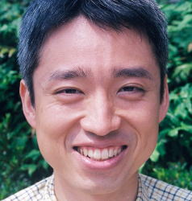
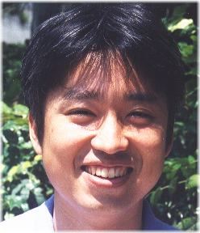
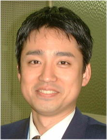

[top](../index.html) / [index](index.html) / [target](https://www.igapyon.jp/igapyon/diary/memo/memohealth.html) / [source](https://github.com/igapyon/diary/blob/master/memo/memohealth.src.md) 

資料: いがぴょんの健康メモ
=====================================================================================================
 日記形式でつづる [いがぴょん](https://www.igapyon.jp/igapyon/diary/memo/memoigapyon.html)コラム ウェブページです。

[old-v2](memohealth-orig.html)

いがぴょんの健康に関するメモ

## 資料: いがぴょんの健康メモ

[いがぴょんのウェブページトップへ戻る](../../index.html)

## いがぴょんの健康メモ

このページは かなり私個人の主張・信条が入っています。私は これが正しいと思っていますが、世間的な一般認識とはかなり異なっている点を理解の上お読み下さい。※自分の考えと違う主張について知ることを嫌われる方については、これ以降の文章は読まれないことをおすすめします。

私は 日本に古くから伝わる東洋医学によって とても助けられています。日本古来の東洋医学の中で、鍼灸というものがあります。私は鍼灸のジャンルのうち、日本式『整体はり』にかかっています。 私は 日本式『整体はり』にとてもお世話になり、また助けられながら 健康を維持向上しています。

日本式『整体はり』に通いだす直接的なきっかけは、強度の飛蚊症や視野が急に狭まっってきたことによるものです。もともとははり治療という選択肢は知っていたのですが、どうも怖かったので 私はこれを最後の手段と定義していました。しかし強度の飛蚊症によって 視界の中で 見えない箇所が ぐわわっと広がり しかも目が痛くとてもコンピュータを使った仕事なんてできそうにない状態になったからです。というか普段の生活でも この症状はかなり問題でした (コンピュータの仕事って、デフォルトでも目に来ますからなぁ…)日本式『整体はり』に通い出してからは 東洋医学的発想なのですが、『内臓が悪い』というのが直接的原因として定義され、内臓の改善のためにからだの歪みを取るところから治療は入りました。もともと私は 子どもの時から健康診断の際に 『脊椎側彎症っぽい』なんて言われていたのですが、大人になるに従ってそれの矛盾が蓄積していたようなのです。

* 脊椎など骨格が歪む  
* →ずれた骨格が血管を圧迫
* →圧迫された血管の血行が悪くなる
* →悪い血行によって 内臓などの機能が不全状態になる
* →内蔵の機能が不全状態になったことにより 強度の飛蚊症などが発生してしまう

というメカニズムによって 強度の飛蚊症が発生している、というのが 先生の初見の所見でした。で 実際に 数年通院した結果、ここ最近 飛蚊症は ずいぶん緩和されてきています。それ以外にも日常的健康という面でも かなり改善はされだしてきました。整体はりは 私にとっては絶大な効果がありました。視野の広さも 最悪の時から比較すると ずいぶん復元してきました。(ご協力頂いている会社の方々にも感謝しています)また、オマケとして 体重が随分減ってきたり またスリムになっています。いろんな意味で身体も軽くなってきました。

しかし、私が通っている整体はり は はり治療のジャンルの中でも マイノリティーであるようです。はりによって整体できるなどとは信じていない鍼灸師も存在するようです。でも 実際 はりだけで骨は動きます。なんといっても、私は身を以て知っているからです。ぐぐぐっと動きます。(人によっては骨の移動を感じない人もいるようですが… 個人差あります)

一方 整体によって骨格のずれや筋肉のずれが修正されたら 血行が良くなり 健康維持向上につながる、ということそのものについては最近の西洋医学でも認知され始めているようです。およそ整体などのジャンルはもともと 東洋医学が 随分先行していたはずなのですが、最近の西洋医学について少しずつ 東洋医学が到達しているレベルについて気がつき始めているようです。西洋医学も意外にやるじゃんって感じです。でもまだまだ このジャンルは 東洋医学の方が 一日の長があるようです。

基本的に 私は伝統を持った 日本の民間医療については、ある程度は信じる傾向にあります。その中でも日本式鍼灸は 国家資格制度もあり 厚生労働省から 治療行為として認可されている数少ない民間医療行為なのです。べつに 国家のお墨付きがあるかどうかは 私にはどうでも良いのですけれどもね。しかし、最近歴史の浅い 民間医療類似行為や 舶来医療類似行為が世間的に横行して流行しています。このことは良い傾向だとは思っていません。それら歴史の浅い医療類似行為と 伝統ある医療行為とをまぜこぜに捉えられかねないからです。とはいえ、私が本当に信じてそして利用しているのは、日本式『整体はり』という 医療行為に分類されている中でも、さらに狭いジャンルのものについてなのです。というのも、昔あんま・マッサージに通っていましたが、肩こりが少し緩和などはありましたが、根本的なところ(強度の飛蚊症など)は全然治りませんでしたから…。実際に自分に効いて効果があったものだけしか信じられませんからね…。しかし悲しいかな あんま・マッサージについては、健康保険が適用できる数少ないケースがあるのですが…。健康保険が適用されれば、随分支払う金額は減るのですけれどもね。

とはいえ、私は 整体はり を万人に勧めるわけではありません。これは 整体はりが人によって向き・不向きが分かれる治療であることを 知識として知っているからです。また整体はりは 随分通院しないと効果が出ない場合もありますし、なによりも費用が結構かかるという点もハードルとしてものすごく大きいと思います。しかし例えば 西洋医学ではの各種検査では健康なのだけれども、実際に体調不良を抱えて非常に困っている方、などには整体はり は 効果が期待できる可能性の一つとして 確実に存在しているのだ、ということはまあ 伝えられるかも、とも思います。自分自身としては 日本式整体はり が無くてはならないものなのですけれどもね。

## いがぴょん近影変遷

体調の変遷が把握しやすいので、その当時の写真を並べてみました。(トランプのカードじゃないんだから並べるというのもなんですが)
2001.07と2003.06とは 体重はそのものあまり変化無いはずなのですが、見た感じはかなり変わっています。仕組みとしては、顔のむくみが取れたものと考えています。

2003.06

2001.07

2000.04

## 変更履歴

* 2003.06.14 新規作成

----------------------------------------------------------------------------------------------------

## この日記について

* ホームページ更新者: 伊賀 敏樹 / Tosiki Iga
* [Diary](https://www.igapyon.jp/igapyon/diary/) / [Facebook](https://www.facebook.com/igapyon) / [LinkedIn](https://www.linkedin.com/in/toshikiiga) / [GitHub](https://github.com/igapyon) / [Qiita](https://qiita.com/igapyon) / [Mastodon](https://social.vivaldi.net/@igapyon) / [X/Twitter](https://twitter.com/ToshikiIga) / [Amazon](https://www.amazon.co.jp/%E4%BC%8A%E8%B3%80-%E6%95%8F%E6%A8%B9/e/B004LTQWCQ) / 
[Share on Twitter](https://twitter.com/intent/tweet?hashtags=igapyon%2Cdiary%2C%E3%81%84%E3%81%8C%E3%81%B4%E3%82%87%E3%82%93&text=%E8%B3%87%E6%96%99%3A+%E3%81%84%E3%81%8C%E3%81%B4%E3%82%87%E3%82%93%E3%81%AE%E5%81%A5%E5%BA%B7%E3%83%A1%E3%83%A2&url=https%3A%2F%2Fwww.igapyon.jp%2Figapyon%2Fdiary%2Fmemo%2Fmemohealth.html) / [top](../index.html) / [いがぴょんについて](https://www.igapyon.jp/igapyon/diary/memo/memoigapyon.html) / [Powered by Igapyonv3](https://github.com/igapyon/igapyonv3)
* 本サイトの見解は、私 個人のものであり、株式会社レザボア・コンサルティング は当個人的見解に一切責任を持ちません。 
